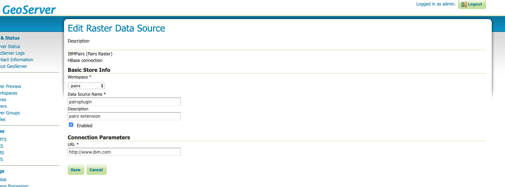

# Pairs plugin for geoserver to serve images from pairs backend hbase
## Developer docs & geoserver source code refs
[Geotools raster](http://docs.geotools.org/latest/userguide/tutorial/raster/image.html#grid-coverage
)

[CSV file plugin from geotools](http://docs.geotools.org/latest/userguide/tutorial/datastore/intro.html)

DigitalGlobal's geoserver plugin for their raster data. You can see it is less than 3,000 lines. 
[DigitalGlobal's geoserver plugin mrgeo](https://github.com/ngageoint/mrgeo-geoserver-plugin.git)


### Other resources
Extension using PairsGetMapCallbackAdapter.java [ref](https://gis.stackexchange.com/questions/134667/developing-geoserver-extension)
(https://github.com/geoserver/geoserver/blob/master/src/wms/src/main/java/org/geoserver/wms/GetMapCallback.java)
(https://github.com/geoserver/geoserver/blob/master/src/wms/src/main/java/org/geoserver/wms/GetMapCallbackAdapter.java)


### Configuration of the plugin via screen shots
First, go to workspaces tab and create `pairs` workspace and make it default


The layer with the plugin:
[link](http://pairs-alpha.res.ibm.com:8082/geoserver/web/wicket/bookmarkable/org.geoserver.web.data.layer.LayerPage?7)

Image of plugin store:


image of plugin layer:


plugin layer data tab settings 1:


plugin layer data tab settings 1:


plugin layer publishing tab settings 1:


plugin layer publishing tab settings 2:


## need to start reflecting these issues and feature requests in Github
codebase uses pairs-data-service on host (pairs-web04) with dynamic image, and exact stitching
Pairs-hbase geoserver extension uses returned metadata from pairs-data-service

## WEb client UI
### access
deployed as static web page on pairs-alpha /pairs_data/datapreview
[Web client openlayer 49180](https://pairs-alpha.res.ibm.com:8080/datapreview/pairsclient.html)
[Johannes box notes](https://ibm.ent.box.com/folder/80649254304?utm_source=trans&utm_medium=email&utm_campaign=collab%2Bauto%20accept%20user)

Bob Goodman created accounts
"hendrikh@us.ibm.com"
"lus@us.ibm.com"
"johannes.schmude@ibm.com"
"dantress@uk.ibm.com"
"dwolfson@us.ibm.com"```

On Dev a MVP Admin user has been created `admin_dev@ibm.com`
On Pre a MVP Admin user has been created `admin_pre@ibm.com`
On Prod a MVP Admin user has been created `admin_prod@ibm.com`


### temporal
user choses bounding box
- client finds first timestamp that data available for at center of box and displays that raster data

- concurrently, client fills in data availability preview table in UI for years and months corresponding to year
of current display 

- concurrently, client also samples for timestamps in other point of the boudning box if this raster is a tiled image rather
than a global image at uniform TS

- User can then pick year, month, and ts options displayed in dropdown for that month
These TS may be for multiple points in the figure, its basically the union

Trying to read config file pairsConfig.json in jar file on geoserver the read url is
```
jar:file:/pairs_data/www/apache-tomcat-8.5.34-geoserver2/webapps/geoserver/WEB-INF/lib/pairs-hbase-plugin-0.9.jar!/pairsconfig.json
```
and it fails to read

### Solution 
update methods in FileUtilities with those from pairs-test which distinguish read resource from jar in resources as stream
against read in file system.

URL for FJM openlayers nodejs page
node.js soure pairs-alpha:hduser/fjm/view
to build and deploy (look at script doit.sh in ~/fjm/view): 
npm run build
cp dist/* /pairs_data/datapreview/


[pairs geoscope query](https://ibmpairs-pre.mybluemix.net/queries/ad1fbba9-a7ef-4714-8e97-36f5e8430c26?layer=1262809364&layerOpacity=100&mapType=satellite)

## Style sheets
Using 'static' style sheet in file served by nginx URL still fails to be accepted by Geoserver as of Mar, 2019. Web browser also fails to recognize the 'static' page as
valid XML. But [dynamic server works](https://pairs.res.ibm.com/map/sld?type=raster&min=0.001&max=1&colorTableId=31&no_data=0&property=value&layer=pairs:pairspluginlayer)
### Handle No_data
no soution yet, but look at geoserver source where IndexColorModel is built.

## New features
### Support WMS getFeatureInfo, need to add geoserver extension
Example:
```http://localhost:8080/geoserver/nurc/wms?SERVICE=WMS&VERSION=1.1.1&REQUEST=GetFeatureInfo&FORMAT=image%2Fjpeg&TRANSPARENT=true&QUERY_LAYERS=nurc%3AImg_Sample&LAYERS=nurc%3AImg_Sample&exceptions=application%2Fvnd.ogc.se_inimage&INFO_FORMAT=text%2Fhtml&FEATURE_COUNT=50&X=50&Y=50&SRS=EPSG%3A4326&STYLES=&WIDTH=101&HEIGHT=101&BBOX=-102.60618874951243%2C27.925998365124457%2C-84.85228249951243%2C45.67990461512446```

### Proper Datastore extension for PAIRs
public interface FileDataStoreFactorySpi extends DataStoreFactorySpi 
package org.geotools.data.shapefile;
ShapeFileDataStoreFactory.java
look at filedatastorefactoryspi.java in geotools source

## Contacts at geosolutions
[forums](http://osgeo-org.1560.x6.nabble.com/GeoServer-User-f3786390.html) look for geoserver

fernando.mino@geo-solutions.it
Ing. Andrea Aime 
GeoSolutions S.A.S. 
Tech lead 

## Current issue for IBMPairs
nginx reverse proxy pairs alpha admin (f@iryP0werB8ll)
Note, Tomcat/geoserver protocol is http as this is Tomcat config (server.xml)
From client browser perspective:
- on local machine click geoserver login and redirect 302: Location: /geoserver/web
- on geoserver with nginx login redirect 302: Location: http://pairs-alpha.res.ibm.com/geoserver/web/wicket/bookmarkable/org.geoserver.web.GeoServerLoginPage;jsessionid=A6F8CA22C9D47E8E395B64DA50E685F2?error=true


## History of issues
Pan zoom not working correctly
Publish new layer from store first call ht x width = 5 x 5, I return 384 x 768 whole world

Preview first req is 
```
http://localhost:8080/geoserver/pairs/wms?service=WMS&version=1.1.0&request=GetMap&layers=pairs%3Apairspluginlayer&bbox=-180.0%2C-90.0%2C180.0%2C90.0&width=768&height=384&srs=EPSG%3A4326&format=application/openlayers
```
data service sees:
```2019-01-14 09:51:04 INFO  DirectDataQueryController:106 - Request Image Request: datasetId: 133, timestamp: 1435708800, ImageDescriptor: Bounding box: SW(lon,lat): (-180.000000, -90.000000), NE(lon,lat): (180.000000, 90.000000), Height: 384, Width: 768
2019-01-14 09:51:04 INFO  DatalayerDAOImpl:103 - dataset Id: 133
2019-01-14 09:51:04 INFO  DatalayerDAOImpl:124 - dataset Id: 133
Hibernate: SELECT * from pairs.pairs_data_layer WHERE dset = ?
2019-01-14 09:51:04 INFO  RasterQueryResults:40 - Pixel level: 11, Datalayer: 29km Crop Fraction
2019-01-14 09:51:04 INFO  RasterQueryResults:97 - Record ct: 882
2019-01-14 09:51:04 INFO  DirectDataQueryController:116 - Response ImageDescriptor: Bounding box: SW(lon,lat): (-180.000000, -90.000000), NE(lon,lat): (21.326592, 10.663296), Height: 384, Width: 768
```
Have to figure out why box is smaller, rounding error in computing pixel level?

Then I try customize Submit request, including customized qury parameters XXX=YYY (put this url in the preview browser and reload page) from layer preview of:
```
http://localhost:8080/geoserver/pairs/wms?service=WMS&version=1.1.0&request=GetMap&layers=pairs%3Apairspluginlayer&bbox=-80%2C30%2C-70%2C40.0&width=768&height=384&srs=EPSG%3A4326&format=application/openlayers&XXX=YYY
```

```
2019-01-14 10:13:02 INFO  DirectDataQueryController:106 - Request Image Request: datasetId: 133, timestamp: 1435708800, ImageDescriptor: Bounding box: SW(lon,lat): (-91.889600, 26.543000), NE(lon,lat): (-58.139600, 43.418000), Height: 384, Width: 768
2019-01-14 10:13:02 INFO  DatalayerDAOImpl:103 - dataset Id: 133
2019-01-14 10:13:02 INFO  DatalayerDAOImpl:124 - dataset Id: 133
Hibernate: SELECT * from pairs.pairs_data_layer WHERE dset = ?
2019-01-14 10:13:02 INFO  RasterQueryResults:40 - Pixel level: 13, Datalayer: 8km Crop Fraction
2019-01-14 10:13:03 INFO  RasterQueryResults:97 - Record ct: 288
2019-01-14 10:13:03 INFO  DirectDataQueryController:116 - Response ImageDescriptor: Bounding box: SW(lon,lat): (-91.889600, 26.543000), NE(lon,lat): (-41.557952, 51.708824), Height: 384, Width: 768
```


### How to get the 'XXX=YYY'? 
Geoserver log has a record:
Use threadlocal data as in code;
also, we can send back our own header by getting HttpServletResponse off this ThreadLocal.
Already tested and verify send custom ibmpairs header back to geoserver client.


```
Request: getServiceInfo
2019-01-14 10:12:57,687 INFO [geoserver.wms] - 
Request: getMap
	Angle = 0.0
	BaseUrl = http://localhost:8080/geoserver/
	Bbox = SRSEnvelope[-80.0 : -70.0, 30.0 : 40.0]
	BgColor = java.awt.Color[r=255,g=255,b=255]
	Buffer = 0
	CQLFilter = null
	Crs = GEOGCS["WGS 84", 
  DATUM["World Geodetic System 1984", 
    SPHEROID["WGS 84", 6378137.0, 298.257223563, AUTHORITY["EPSG","7030"]], 
    AUTHORITY["EPSG","6326"]], 
  PRIMEM["Greenwich", 0.0, AUTHORITY["EPSG","8901"]], 
  UNIT["degree", 0.017453292519943295], 
  AXIS["Geodetic longitude", EAST], 
  AXIS["Geodetic latitude", NORTH], 
  AUTHORITY["EPSG","4326"]]
	Elevation = []
	Env = {}
	Exceptions = SE_XML
	FeatureId = null
	FeatureVersion = null
	Filter = null
	Filters = null
	Format = application/openlayers
	FormatOptions = {}
	Get = true
	Height = 384
	Interpolations = []
	Layers = [org.geoserver.wms.MapLayerInfo@9269607c]
	MaxFeatures = null
	Palette = null
	RawKvp = {REQUEST=GetMap, SRS=EPSG:4326, FORMAT=application/openlayers, BBOX=-80,30,-70,40.0, VERSION=1.1.0, XXX=YYY, SERVICE=WMS, WIDTH=768, HEIGHT=384, LAYERS=pairs:pairspluginlayer}
	RemoteOwsType = null
	RemoteOwsURL = null
	Request = GetMap
	RequestCharset = UTF-8
	ScaleMethod = null
	Sld = null
	SldBody = null
	SldVersion = null
	SortBy = null
	SortByArrays = null
	SRS = EPSG:4326
	StartIndex = null
	StyleBody = null
	StyleFormat = sld
	Styles = [StyleImpl[ name=raster]]
	StyleUrl = null
	StyleVersion = null
	Tiled = false
	TilesOrigin = null
	Time = []
	Transparent = false
	ValidateSchema = false
	Version = 1.1.0
	ViewParams = null
	Width = 768
```

### Zoom through pixels levels 11,12, 13, 14, 15 16, but attempt to hit 17 failing
### Fixed since March
2019-01-14 10:27:14 INFO  RasterQueryResults:40 - Pixel level: 16, Datalayer: 1km Crop Fraction
2019-01-14 10:27:14 ERROR DirectDataQueryController:122 - 

### Bugs below seem to be fixed
[store:](http://user:pw@www.ibm.com/?htable=hname&cf=cfn)
debugger null ptr exception in class OpenLayersMapOutputFormat extends AbstractOpenLayersMapOutputFormat
```
private boolean hasOnlyCoverages(WMSMapContent mapContent) {
        for (Layer layer : mapContent.layers()) {
            FeatureType schema = layer.getFeatureSource().getSchema();
            boolean grid =
```            

error: Unable to acquire test coverage and color model for format
[colormodel issue](http://osgeo-org.1560.x6.nabble.com/Unable-to-acquire-a-reader-for-this-coverage-with-format-ImageMosaic-td3789310.html)

## Detailed steps for PairsGeotiffPlugin
( Broad overview parent readme is [here](../../README.MD))
This details coding, operation, build, install of Pairs plugin in geoserver WEB_INF/lib/
Test files:
/Users/bobroff/projects/pairs/geospatial-datasets/normtest.tiff
/Users/bobroff/projects/pairs/geospatial-datasets/merc_ob.tiff
/Users/bobroff/projects/pairs/geospatial-datasets/HYP_LR/HYP_LR.tif
*NOTE* Use above form from root or file:/User/...  DO NOT USEthe url form file://, just the path from root
*TODO* Track this down


## Code path in our extension when new datastore is created
### Geoserver UI Add stores
< Call Stack>
```java
PairsGeoTiffFormat.<init>() (/Users/bobroff/projects/pairs/pairs-code/pairs-geoserver-plugin/plugin/geotiff-hbase/src/main/java/com/ibm/pa/pairs/geoserver/plugin/geotiff/PairsGeoTiffFormat.java:123)
PairsGeoTiffFormatFactory.createFormat() (/Users/bobroff/projects/pairs/pairs-code/pairs-geoserver-plugin/plugin/geotiff-hbase/src/main/java/com/ibm/pa/pairs/geoserver/plugin/geotiff/PairsGeoTiffFormatFactory.java:96)
GridFormatFinder.getFormatArray() (/gt-coverage-20.0.jar/org.geotools.coverage.grid.io/GridFormatFinder.class:119)
NewDataPage.getAvailableCoverageStores() (Unknown Source:202)
NewDataPage.<init>() (Unknown Source:52)
NativeConstructorAccessorImpl.newInstance0(Constructor,Object[])[native method] (Unknown Source:-1)
NativeConstructorAccessorImpl.newInstance(Object[]) (Unknown Source:62)
DelegatingConstructorAccessorImpl.newInstance(Object[]) (Unknown Source:45)
Constructor.newInstance(Object[]) (/rt.jar/java.lang.reflect/Constructor.class:423)
DefaultPageFactory.newPage(Constructor,PageParameters) (Unknown Source:175)
DefaultPageFactory.newPage(Class) (Unknown Source:67)
DefaultMapperContext.newPageInstance(Class,PageParameters) (Unknown Source:102)
PageProvider.resolvePageInstance(Integer,Class,PageParameters,Integer) (Unknown Source:271)
PageProvider.getPageInstance() (Unknown Source:169)
PageRenderer.getPage() (Unknown Source:78)
WebPageRenderer.isPageStateless() (Unknown Source:287)
WebPageRenderer.shouldRenderPageAndWriteResponse(RequestCycle,Url,Url) (Unknown Source:329)
WebPageRenderer.respond(RequestCycle) (Unknown Source:193)
RenderPageRequestHandler.respond(IRequestCycle) (Unknown Source:175)
RequestCycle$HandlerExecutor.respond(IRequestHandler) (Unknown Source:895)
```

PairsGeoTiffFormat constructor
- Fill in minfo var from parent class AbstractGridFormat
  - This sets the display name
- Fill in readParameters (maybe here we have to set our own reader?)

### UI list of stores appears, select PairsGeotiff
- We are now in create popup, but note the 'browse' is not available so something is missing
- input datastore name and file:///Users/bobroff/projects/pairs/geospatial-datasets/normtest.tiff
  - if name doesn't correspond to a file
    - Error box appears telling us so
    - The plugin is not hit yet
- Now 'save' and we are hit in getReader()
```java
PairsGeoTiffFormat.getReader(Object,Hints) (/Users/bobroff/projects/pairs/pairs-code/pairs-geoserver-plugin/plugin/geotiff-hbase/src/main/java/com/ibm/pa/pairs/geoserver/plugin/geotiff/PairsGeoTiffFormat.java:294)
PairsGeoTiffFormat.getReader(Object,Hints) (/Users/bobroff/projects/pairs/pairs-code/pairs-geoserver-plugin/plugin/geotiff-hbase/src/main/java/com/ibm/pa/pairs/geoserver/plugin/geotiff/PairsGeoTiffFormat.java:76)
ResourcePool.getGridCoverageReader(CoverageStoreInfo,CoverageInfo,String,Hints) (Unknown Source:1528)
ResourcePool.getGridCoverageReader(CoverageStoreInfo,String,Hints) (Unknown Source:1474)
CoverageStoreInfoImpl.getGridCoverageReader(ProgressListener,Hints) (Unknown Source:53)
NativeMethodAccessorImpl.invoke0(Method,Object,Object[])[native method] (Unknown Source:-1)
NativeMethodAccessorImpl.invoke(Object,Object[]) (Unknown Source:62)
DelegatingMethodAccessorImpl.invoke(Object,Object[]) (Unknown Source:43)
Method.invoke(Object,Object[]) (/rt.jar/java.lang.reflect/Method.class:498)
ModificationProxy.invoke(Object,Method,Object[]) (Unknown Source:128)
$Proxy25.getGridCoverageReader(ProgressListener,Hints) (Unknown Source:-1)
NewLayerPageProvider.getItemsInternal() (Unknown Source:100)
NewLayerPageProvider.getItems() (Unknown Source:61)
GeoServerDataProvider.getFilteredItems() (Unknown Source:202)
NewLayerPageProvider.getFilteredItems() (Unknown Source:200)
GeoServerDataProvider.size() (Unknown Source:220)
GeoServerTablePanel$PagerDelegate.updateMatched() (Unknown Source:597)
GeoServerTablePanel$PagerDelegate.<init>(GeoServerTablePanel) (Unknown Source:592)
GeoServerTablePanel.<init>(String,GeoServerDataProvider,boolean) (Unknown Source:182)
GeoServerTablePanel.<init>(String,GeoServerDataProvider) (Unknown Source:96)
```

- Source is a file
((File) source).getAbsolutePath()
"/Users/bobroff/projects/pairs/geospatial-datasets/normtest.tiff" (id=943)

- return new PairsGeoTiffReaderBuildCoverage(source, hints);
  - Constructor needs the (image)inputStreams set up for the source
        // /////////////////////////////////////////////////////////////////////
            //
            // Get a stream in order to read from it for getting the basic
            // information for this coverage
            //
            // /////////////////////////////////////////////////////////////////////
            if ((source instanceof InputStream) || (source instanceof ImageInputStream))
            .
            .
            .
- Since the datastore source is a file this code looks for a registered extender of ImageInputStreamSPI (service provider interface) that has a class type (e.g File) that handles this input type (File)

```java
inStreamSPI = ImageIOExt.getImageInputStreamSPI(source);
                if (inStreamSPI == null)
                    throw new IllegalArgumentException("No input stream for the provided source");
                inStream =
                        inStreamSPI.createInputStreamInstance(
                                source, ImageIO.getUseCache(), ImageIO.getCacheDirectory());
```

- ImageIOExt uses IIORegistry so we could add a custom ImageInputStreamSPi class there 
 
 ```java
 // Ensure category is present
        try {
            iter =
                    IIORegistry.getDefaultInstance()
                            .getServiceProviders(ImageInputStreamSpi.class, true);
        } catch (IllegalArgumentException e) {
            return null;
        }

        boolean usecache = ImageIO.getUseCache();

        ImageInputStreamSpi spi = null;
        while (iter.hasNext()) {
            spi = iter.next();
            if (spi.getInputClass().isInstance(input)) 
```

- Here if verifies that the Spi which is a *FileImageInputStreamExtImplSpi* can handle a File.class input

- Then verifies that an ImageInputStream can be created from that spi. Note the test stream is not used

```java
try {
                        stream =
                                spi.createInputStreamInstance(
                                        input, usecache, ImageIO.getCacheDirectory());
```

- (We could add our own provider class for inStreamSPI and inStream, but I don't think we need to)
If we do, I believe we make a new inStreamSPI and give it the name of our custom reader class then
call the IIORegistry or service registry to add it. I don't think META-INF/interface name technique works

- The stream reader returned here from spi.createInputStreamInstance is:

```java
public  class FileImageInputStreamExtImpl extends ImageInputStreamImpl
        implements FileImageInputStreamExt {
```

- *** The file source is verified that it can be read and decoded. This is very important. ***
I see the breakpoints in public  class FileImageInputStreamExtImpl extends ImageInputStreamImpl
        implements FileImageInputStreamExt { 
being hit in the read method and looking back on the stack it checks if file is JPEG etc by reading a few bites

The caller is javax.image.ImageIO.canDecode(). It also looks for an overview file *.ovr

This is the stack:
```
AsciiGridRaster.getKey(ImageInputStream,int,int,byte) (Unknown Source:1202)
EsriAsciiGridRaster.parseHeader() (Unknown Source:152)
AsciiGridsImageReaderSpi.canDecodeInput(Object) (Unknown Source:217)
ImageIO$CanDecodeInputFilter.filter(Object) (/rt.jar/javax.imageio/ImageIO.class:567)
FilterIterator.advance() (/rt.jar/javax.imageio.spi/ServiceRegistry.class:834)
FilterIterator.next() (/rt.jar/javax.imageio.spi/ServiceRegistry.class:852)
ImageIO$ImageReaderIterator.next() (/rt.jar/javax.imageio/ImageIO.class:528)
ImageIO$ImageReaderIterator.next() (/rt.jar/javax.imageio/ImageIO.class:513)
ImageIOExt.getImageioReader(ImageInputStream) (/gt-coverage-20.0.jar/org.geotools.image.io/ImageIOExt.class:299)
MaskOverviewProvider.getReaderSpiFromStream(ImageReaderSpi,ImageInputStream) (/gt-coverage-20.0.jar/org.geotools.coverage.grid.io.imageio/MaskOverviewProvider.class:653)
MaskOverviewProvider$SpiHelper.<init>(URL,ImageReaderSpi,ImageInputStreamSpi) (/gt-coverage-20.0.jar/org.geotools.coverage.grid.io.imageio/MaskOverviewProvider.class:753)
MaskOverviewProvider$SpiHelper.<init>(URL,ImageReaderSpi) (/gt-coverage-20.0.jar/org.geotools.coverage.grid.io.imageio/MaskOverviewProvider.class:732)
MaskOverviewProvider.<init>(DatasetLayout,File,ImageReaderSpi) (/gt-coverage-20.0.jar/org.geotools.coverage.grid.io.imageio/MaskOverviewProvider.class:103)
MaskOverviewProvider.<init>(DatasetLayout,File) (/gt-coverage-20.0.jar/org.geotools.coverage.grid.io.imageio/MaskOverviewProvider.class:98)
PairsGeoTiffReaderBuildCoverage.getHRInfo(Hints) (/Users/bobroff/projects/pairs/pairs-code/pairs-geoserver-plugin/plugin/geotiff-hbase/src/main/java/com/ibm/pa/pairs/geoserver/plugin/geotiff/PairsGeoTiffReaderBuildCoverage.java:363)
PairsGeoTiffReaderBuildCoverage.<init>(Object,Hints) (/Users/bobroff/projects/pairs/pairs-code/pairs-geoserver-plugin/plugin/geotiff-hbase/src/main/java/com/ibm/pa/pairs/geoserver/plugin/geotiff/PairsGeoTiffReaderBuildCoverage.java:256)
PairsGeoTiffFormat.getReader(Object,Hints) (/Users/bobroff/projects/pairs/pairs-code/pairs-geoserver-plugin/plugin/geotiff-hbase/src/main/java/com/ibm/pa/pairs/geoserver/plugin/geotiff/PairsGeoTiffFormat.java:307)
PairsGeoTiffFormat.getReader(Object,Hints) (/Users/bobroff/projects/pairs/pairs-code/pairs-geoserver-plugin/plugin/geotiff-hbase/src/main/java/com/ibm/pa/pairs/geoserver/plugin/geotiff/PairsGeoTiffFormat.java:76)
ResourcePool.getGridCoverageReader(CoverageStoreInfo,CoverageInfo,String,Hints) (Unknown Source:1528)
ResourcePool.getGridCoverageReader(CoverageStoreInfo,String,Hints) (Unknown Source:1474)
```


- Now back in our ParisGeoTiffReaderBuildCoverageStore we can create the streamreader again
                inStream =
                        inStreamSPI.createInputStreamInstance(
                                source, ImageIO.getUseCache(), ImageIO.getCacheDirectory());


### Once this is done, the PairsG..ReaderBuildCoverage is constructed and returned


### Now we publish a new layer from this store

- GeotiffFormatFactory invoked isAvailable()
- """ createFormat()
- The publish completes, but what is odd is the FileImageInputStream  read breakpoints not hit 

### Layer preview
Now we hit in PairsGeoTiffReaderBuildCoverage.read()
Input parameters

```java
params[0].toString()
"InputTransparentColor = null\n" (id=7080)
params[1].toString()
"SUGGESTED_TILE_SIZE = "512,512"\n" (id=7082)
params[2].toString()
"Interpolation = "javax.media.jai.InterpolationNearest@550a0160"\n" (id=7084)
params[3].toString()
"BackgroundColor = "java.awt.Color[r=255,g=255,b=255]"\n" (id=7087)
params[4].toString()
"ReadGridGeometry2D = "GridGeometry2D[GridEnvelope2D[0..767, 0..383], PARAM_MT["Affine", \n     


requestedEnvelope.toString()
"GeneralEnvelope[(-270.0, -135.0), (270.0, 135.0)]" (id=7289)
layout.toString()
"ImageLayout[TILE_GRID_X_OFFSET=0, TILE_GRID_Y_OFFSET=0, TILE_HEIGHT=512]" (id=7339)
suggestedTileSize[0]
512
suggestedTileSize[1]
512
```

## Typical request URL
http://localhost:8080/geoserver/pairs/wms?SERVICE=WMS&VERSION=1.1.1&REQUEST=GetFeatureInfo&FORMAT=image%2Fjpeg&TRANSPARENT=true&QUERY_LAYERS=pairs%3AHYP_LR&LAYERS=pairs%3AHYP_LR&exceptions=application%2Fvnd.ogc.se_inimage&INFO_FORMAT=text%2Fhtml&FEATURE_COUNT=50&X=50&Y=50&SRS=EPSG%3A4326&STYLES=&WIDTH=101&HEIGHT=101&BBOX=9.77783203125%2C-32.54150390625%2C80.79345703125%2C38.47412109375
